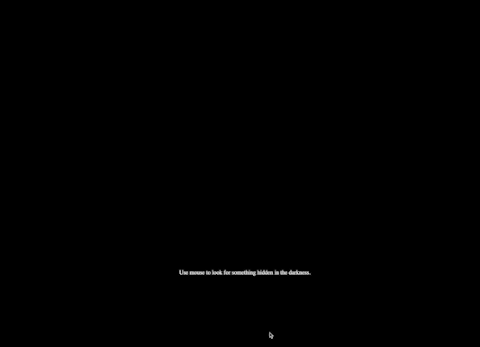

# Dynamic Web Dev
## Final

I followed this [tutorial] (https://dev.to/devland/build-a-todo-app-with-react-and-firebase-47m1) and created a to-do list web app. It utilized React.js and Material UI for the front end and Firebase Cloud Firestore for the backend database.

---

## Week 3: Dynamic Web App Using APIs

### Live Site
https://dynamic-web-dev-week3.glitch.me

### Process
I utlized this free API called [meowfacts](https://github.com/wh-iterabb-it/meowfacts) that returns a random fact about cat each time getting requested and another called [Cataas](https://cataas.com/#/) that gives random cat pictures.
Used `fetch` to make API requests in JavaScript. Made a button that refreshes the page.

---

## Week 2: Swiss Poster Design & Implementation

### Live Site
https://dynamic-web-dev-week2.glitch.me/

### Inspiration & Process
My inspiration came from [this poster](https://www.pinterest.com/pin/11822017764404808/). I made some adaptation to it but kept the main layout. Although I created a js file, I did not end up utilizing any javascript for it.
The process of generating multiple text blocks and ellipses were redundant. There might be a way to use javascript to propagate multiple elements?

---

## Week 1: HTML + CSS

### How to set up and run the application
Go to https://dynamic-web-dev-week1.glitch.me and you will see it live!

### How I built the HTML page
Tool: VS Code

### Inspiration & Process
For this assignment, I played with CSS-based interactions and animations.

The [reference](https://www.youtube.com/watch?v=ucssfp9UXZg) that I found was for a smoke text effect on mouse hover. I followed through the tutorial but ended up only keeping the light shadow part. I created an interaction where the user needs to find the hidden text in the darkness with their mouse. When being hovered over, the text will then reveal itself.

### How I deployed with Glitch
1. Log in with my Github account.
2. Create a new project.
3. Choose "import from Github".
4. Enter the link to the github repo.
